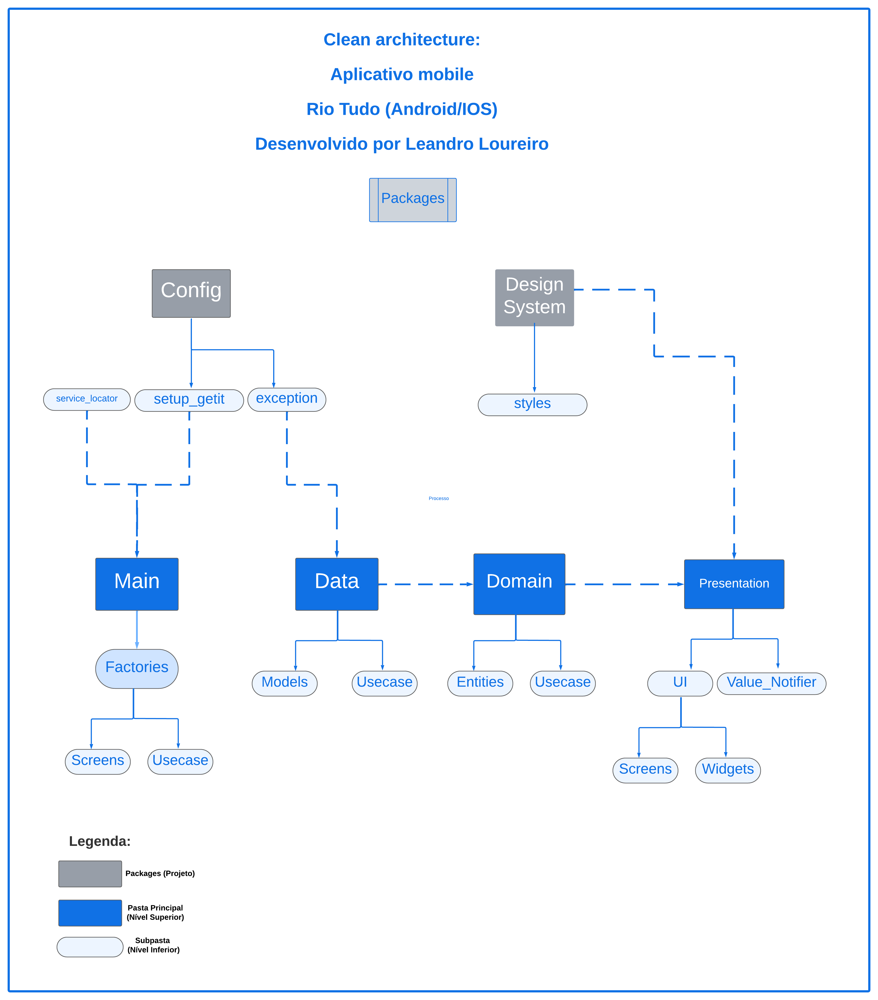

# Flutter Rio Tudo

O Rio Tudo é um aplicativo para celular que tem o objetivo de reunir dicas sobre coisas para fazer no Rio de Janeiro. Desenvolvido em Flutter e disponível para Android e IOS. 

**OBS: Não é permitido o uso do código para publicação ou uso da marca Rio Tudo porque o mesmo possui direitos reservados. Este repositório é para portfólio e estudo da tecnologia Flutter.**

Link do Rio Tudo na Google Play - https://play.google.com/store/apps/details?id=com.br.riotudo
Link do Rio Tudo na App Store - 

Abaixo pode ser analisado tudo que foi utilizado para a implementação do app.

 - Versão do Flutter 3.16.4 e Dart versão 3.23;
 - Estrutura do projeto Clean Architecture (arquitetura aprendida com a experiência em empresas como Bradesco no app Next e app ClaroPay);
 - Projeto orientado a packages;
 - Design System definido para layout;
 - Uso do compute isolate para executar tarefas grandes em diferentes threads;
 - Conceito de SOLID Aberto/Fechado;
 -  Principais packages:
    - Shared Preferences - marcação de dicas favoritas 
    - Url Lancher - redirecionamento da dica para respectivo Instagram
    - Typeahead - textfield sugestivo para busca de dicas por localidade 
    - Staggered Animations - animação dos box de categorias e subcategorias de dicas
- Teste unitários utilizando mockito e mocktail.

Apresentação do app:

https://github.com/leandromltec/flutter-rio-tudo/assets/39128248/14d9a6b7-ee8d-43cc-99eb-613b595e459e

Estrutura de pastas do projeto (Clean Architecture):

Exemplo do Conceito de SOLID Aberto/Fechado aplicado no projeto:

Relatório de testes unitários atingindo uma porcentagem de aprovação:

